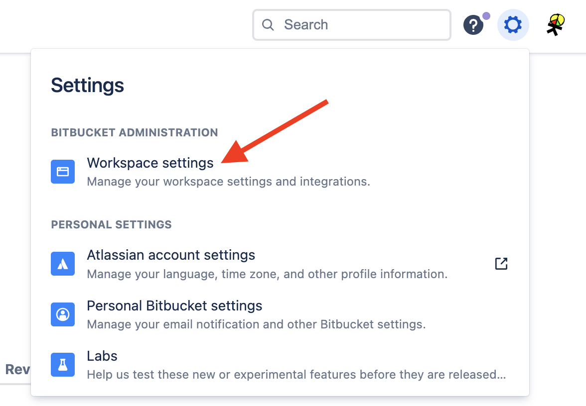
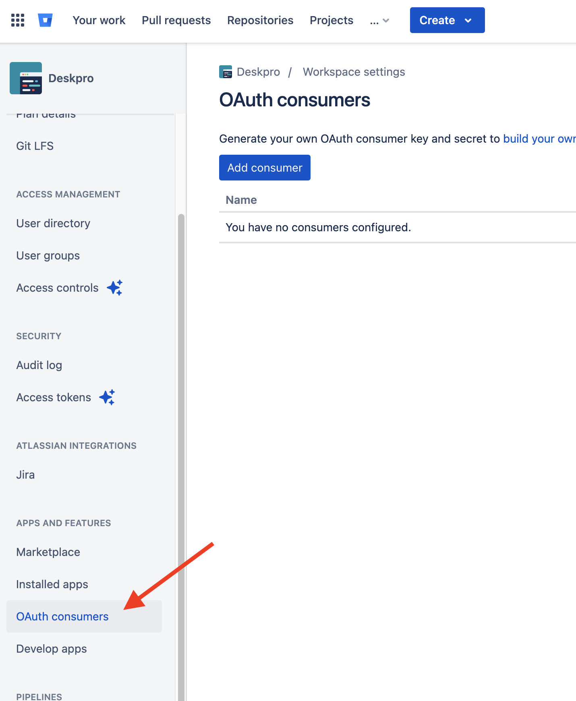
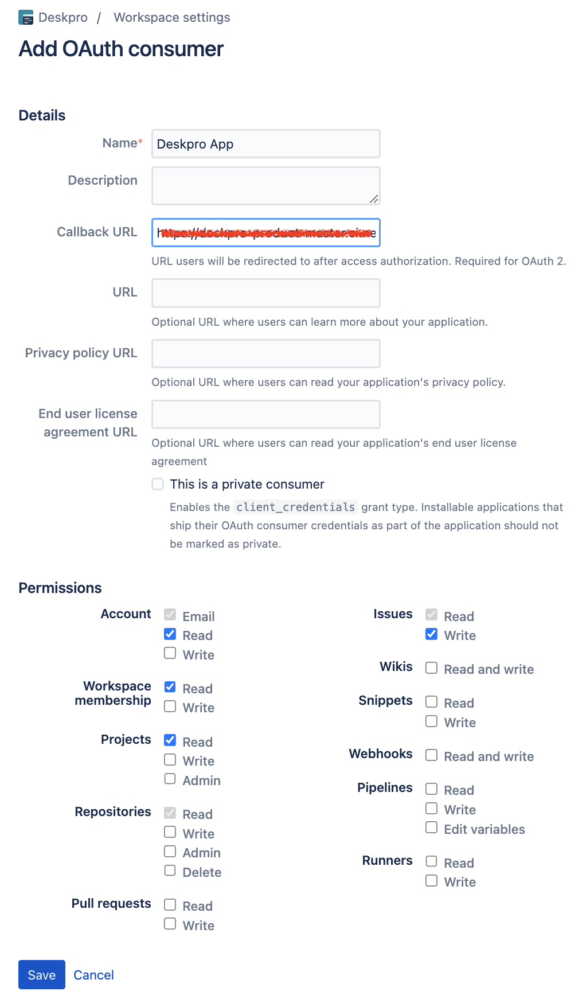
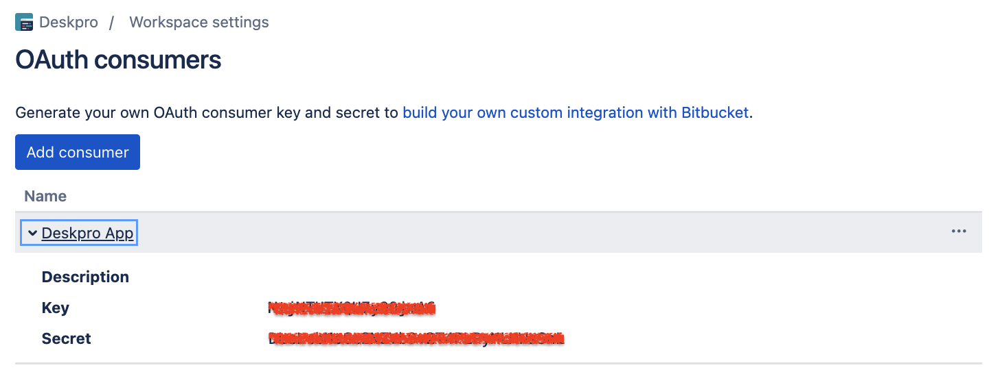

Bitbucket App Setup Instructions
===

To install the Bitbucket app, you must first create an app with a "Key" and "Secret". Head over to your Bitbucket account to get started.

Once you've logged in, click on your avatar at the bottom left of the screen and choose "Workspace settings"

Then navigate to the __"OAuth consumers"__ section on the left sidebar. Here you'll see a button __"Add consumer"__, click it to create the Consumer.

Enter the following details for your new OAuth app:

* __Name:__ this can be anything, something like "Deskpro App" will do
* __Callback URL:__ you can copy this from the Bitbucket settings tab in this admin drawer in Deskpro
* __Permissions:__
  * Account: *Email*, *Read*
  * Issues: *Read*, *Write*
  * Workspace membership: *Read*
  * Projects: *Read*
  * Repositories: *Read*

Then click "Save"

After that, we will see the created consumer. Copy the "Key" and "Secret" and keep them safe.

Next, head back to Deskpro and enter the __Key__ and __Secret__ into the app settings form.

To configure who can see and use the Bitbucket app, head to the "Permissions" tab and select those users and/or groups you'd like to have access.

When you're happy, click "Install".
